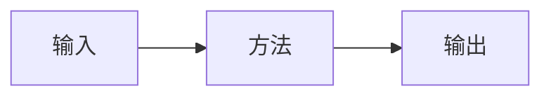

# 论文笔记：TODO

<!-- AUTO:DOCUMENT_META -->

## 论文解决什么问题

TODO

## 动机

TODO

## 输入 / 输出

TODO

## 完整 Pipeline

## 关键模块与公式

TODO

## 训练方法

TODO

## 推理方法

TODO

## 实验结果

TODO

## 局限

TODO

## 我的理解与相关工作

TODO

## 代码与复现状态

TODO
