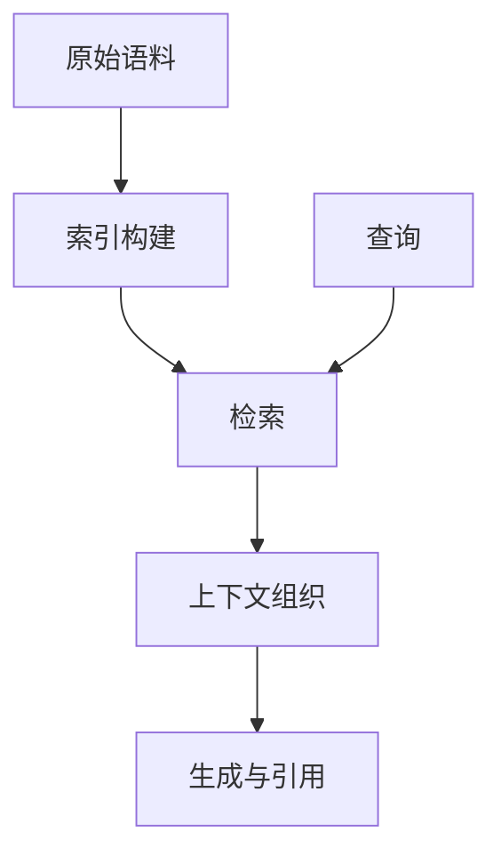

# 论文笔记：LightRAG

<!-- AUTO:DOCUMENT_META -->

!!! warning "内容状态"
    以下是用于验证排版和写作流程的笔记骨架。论文信息、方法描述和结论需要阅读原文后补充。

## 论文解决什么问题

TODO：用一段话描述任务、已有方法的限制以及论文的目标。

## 动机

TODO：解释作者为何选择该表示、检索方式或训练目标。

## 输入 / 输出

| 项目 | 内容 |
| --- | --- |
| 输入 | TODO |
| 输出 | TODO |
| 监督信号 | TODO |

## 完整 Pipeline



TODO：按论文原图逐步核对，避免只写模块名称。

## 关键公式

公式渲染示例：

\[
\mathcal{L} =
\mathcal{L}_{\mathrm{recon}}
+ \lambda \mathcal{L}_{\mathrm{reg}}
\]

TODO：替换为论文中的真实符号定义，并解释各项来源。

## 训练与推理

TODO：分别记录数据构造、优化目标、超参数和推理步骤。

## 实验结果

TODO：阅读原表后填写，不复制无法核实的数字。

## 局限与我的理解

TODO：区分作者明确陈述的局限与自己的推断。

## 代码与复现状态

```bash
# 命令占位：核对仓库后再替换
python example.py --config TODO
```
