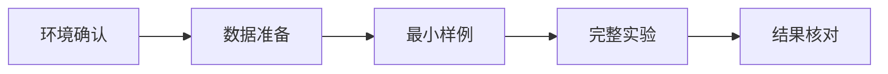

# ArtHOI Reconstruction 复现记录

<!-- AUTO:DOCUMENT_META -->

!!! warning "占位说明"
    本页没有声称复现成功。所有版本、命令和输出都应在真实执行后更新。

## 论文 / Repository

- Paper：TODO
- Repository：TODO
- Commit：TODO（复现时固定到具体 SHA）

## 环境

| 项目 | 版本 |
| --- | --- |
| OS | TODO |
| GPU | TODO |
| Driver | TODO |
| CUDA | TODO |
| Python | TODO |
| PyTorch | TODO |

## 依赖安装

```bash
# 示例结构，请以原仓库说明为准
conda create -n arthoi python=TODO
conda activate arthoi
pip install -r requirements.txt
```

## 数据准备

TODO：记录下载来源、目录结构、校验和及预处理命令。

## 运行命令

```bash
CUDA_VISIBLE_DEVICES=0 python xxx.py --config TODO
```

## Pipeline



## 问题与修复

| 症状 | 根因 | 修复 | 验证 |
| --- | --- | --- | --- |
| TODO | TODO | TODO | TODO |

## 终端输出

```text
[TODO] 粘贴关键日志，不要上传密钥、Token 或私有路径。
```

## 实验结果与最终状态

TODO：附真实图片、GIF 或视频链接，并注明配置、随机种子和 checkpoint。
