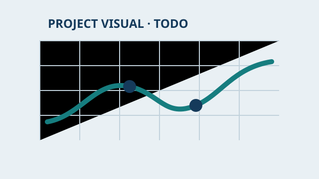

# 写作与发布

这个网站不需要后台、数据库或 CMS。你只需要创建一个 Markdown 文件并提交，GitHub Pages 就会自动更新。

## 最方便：使用 github.dev 在线编辑器

网站仓库创建后，可以直接打开：

[打开 github.dev 在线编辑器](https://github.dev/Xia-zi2/Xia-zi2.github.io){ .md-button .md-button--primary target="_blank" }

也可以在 GitHub 仓库页面按键盘上的 `.`，进入同一个网页编辑器。它看起来接近 VS Code，不需要在本机安装软件。

1. 在左侧找到想写的目录。
2. 复制 `content-templates/` 中对应的模板。
3. 把副本放入下表中的目标目录，并改成简短的英文文件名。
4. 填写文件顶部 `---` 之间的 front matter，然后写正文。
5. 打开左侧 Source Control，填写提交说明并点击 **Commit & Push**。
6. 等待 GitHub Actions 构建完成，网页会自动更新。

!!! tip "推荐的文件名"
    使用小写英文、数字和连字符，例如 `world-string.md`、`flash-rag.md`。中文标题写在 front matter 的 `title` 中。

## 内容放在哪里

| 想写的内容 | 模板 | 保存目录 |
| --- | --- | --- |
| 项目 | `content-templates/project.md` | `docs/projects/` |
| 论文阅读 | `content-templates/paper-note.md` | `docs/papers/` |
| 论文复现 | `content-templates/reproduction-note.md` | `docs/reproductions/` |
| 技术笔记 | `content-templates/technical-note.md` | `docs/learning/` 或其主题子目录 |
| Blog | `content-templates/blog-post.md` | `docs/blog/posts/` |

## 也可以直接使用 GitHub 网页

进入目标目录后点击 **Add file → Create new file**，输入文件名并粘贴模板内容。写完后点击 **Commit changes**。这种方式适合小改动；长文章建议使用 github.dev 或本地编辑器。

## Front matter 最小示例

```yaml
---
title: 论文笔记：WorldString
description: WorldString 的问题、方法与实验阅读记录。
summary: 从表示、Pipeline 和实验三个角度整理 WorldString。
type: paper
date: 2026-09-11
updated: 2026-09-11
status: 阅读中
tags:
  - Computer Graphics
  - 3D Vision
draft: false
---
```

- `description` 用于页面和搜索摘要。
- `summary` 显示在首页最近更新中。
- `updated` 决定首页最近 Notes 的排序。
- `draft: true` 时页面仍可构建，但不会进入首页自动列表；准备公开时改为 `false`。
- 不确定的作者、venue、链接或结果直接写 `TODO`。

## 常用写法

### 数学公式

```text
\[
\mathcal{L} = \mathcal{L}_{recon} + \lambda \mathcal{L}_{reg}
\]
```

### Mermaid

````text

````

### 代码

````text
```bash
CUDA_VISIBLE_DEVICES=0 python train.py --config config.yaml
```
````

### 图片

先把图片放到 `docs/assets/images/`，然后在文章里写：

```markdown

```

如果文章位于更深的子目录，需要相应增加 `../`。提交前确认图片中没有密钥、私人路径或敏感数据。

## 首页如何自动更新

- `docs/papers/`、`docs/reproductions/` 和 `docs/learning/` 中的新 Markdown 会按 `updated` 自动进入“最近更新的 Notes”。
- `docs/blog/posts/` 中的新文章会自动进入“最近 Blog”和 Blog 归档。
- 项目设置 `featured: true` 后会进入首页，“weight” 越小排序越靠前。
- 搜索和标签在每次构建时自动生成。

通常不需要修改首页 HTML。只有希望把一篇文章固定到左侧导航时，才需要在 `mkdocs.yml` 的 `nav` 中加一行。

## 本地写作

如果希望边写边预览：

```powershell
.\.venv\Scripts\Activate.ps1
mkdocs serve
```

打开 <http://127.0.0.1:8000/>，保存 Markdown 后页面会自动刷新。写完后：

```bash
git add .
git commit -m "docs: add WorldString paper note"
git push
```

## 发布失败时

进入 GitHub 仓库的 **Actions** 页面，打开最近一次“构建并部署 GitHub Pages”。常见原因是：

- front matter 缩进不正确；
- 引用了不存在的本地图片；
- 文件名或链接拼写错误；
- Blog 缺少 `date`。

修正后再次提交即可触发新构建。
